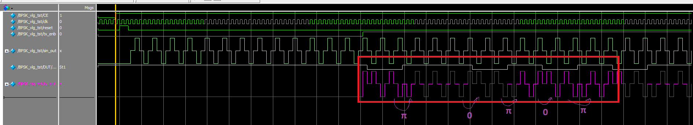
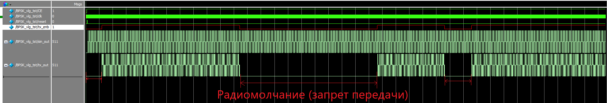
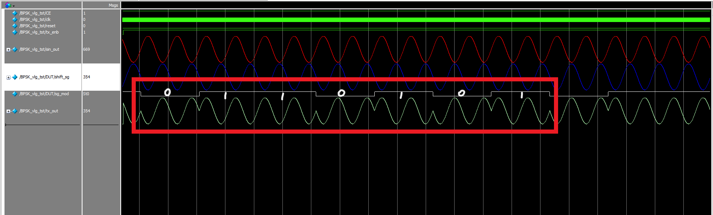

# BPSK_modulator
This module implements the BPSK modulator (manipulator). Written in Verlog.

На этом скриншоте видим промодулированного сигнала на промежуточной частоте.
Ts = N*Tclk. Tsin = Tclk*4.  N=8

Здесь можем пронаблюдать за вариацией сигнала запрета передачи данных tx_enb.
Во время радиомолчания сигнал на выходе находится в состоянии Z

Для наглядность попробуем генерировать сигнал более высокого разрешения (при этом уменьшается его частота)
Tsin = Tclk*255*4 = Tclk*1020. Ts = 1020*2*Tclk = 2040*Tclk.

